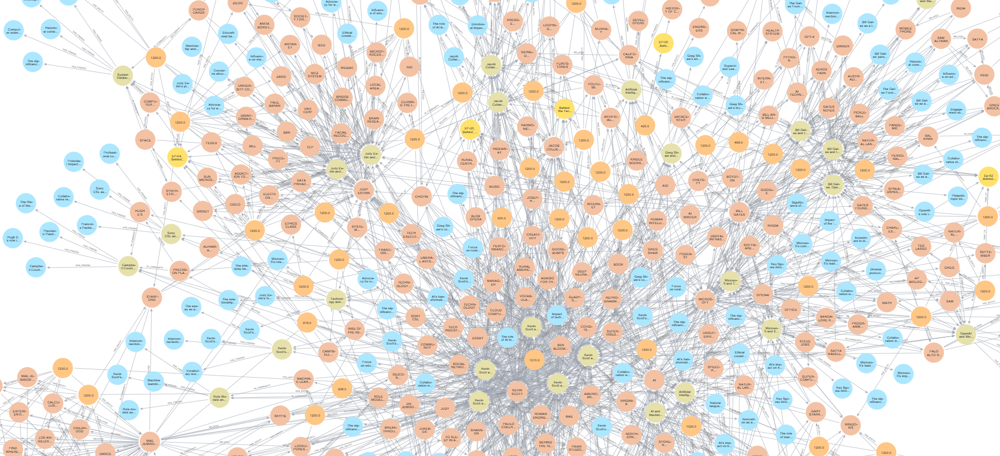

# Graph RAG Podcasts

A Graph RAG demo application using Microsoft's Behind The Tech podcast transcripts to demonstrate the power of Graph-enhanced RAG (Retrieval Augmented Generation) compared to traditional RAG approaches.

*Graph visualization of entity relationships extracted from the podcast transcripts. Nodes represent entities (people, organizations, locations, events) and edges represent their relationships within the context.*

## Overview

This project implements both traditional RAG and Graph-enhanced RAG using transcripts from the [Microsoft Behind The Tech](https://www.microsoft.com/en-us/behind-the-tech) podcast series. It demonstrates how Graph RAG can provide more contextually relevant answers by leveraging relationship connections between chunks of text.

## Dataset

The dataset consists of podcast transcripts from Microsoft's Behind The Tech series:
- Total episodes processed: 67
- Episodes selected for demo: 10 (smallest by token count)
- Total tokens in selected files: 66,597
- Average tokens per file: 6,659

### Selected Episodes
1. Behind-the-Tech_EP-38_StevenPinker_Transcript (0 tokens)*
2. Behind-the-Tech_EP39_2021_Year-in-Review_Transcript (0 tokens)*
3. EP-00_Behind_the_Tech_Kevin Scott_Podcast_Trailer (420 tokens)
4. EP-20_Behind_the_Tech_Kevin_Scott_Podcast_ReprogrammingTheDream (8,200 tokens)
5. Behind the Tech_Episode 30_Collier_Bloomberg_Transcript (8,770 tokens)
6. Ep-52_Behind_the_Tech_Kevin_Scott_Podcast_with_Bill_Gates-qc (9,288 tokens)
7. EP-28_Behind_the_Tech_Mae-Jemison (9,618 tokens)
8. Behind the Tech_Episode 35_StevenBathiche_Transcript (9,825 tokens)
9. EP-04_Behind_the_Tech_Kevin Scott_Podcast_with_Judy Estrin (10,106 tokens)
10. EP-40_Behind_the_Tech_DanielaRus_Transcript (10,370 tokens)

*Note: Empty transcripts were kept for comparison purposes

## Setup

1. Clone the repository:
```bash
git clone https://github.com/Abhi001vj/graphh-rag-podcasts.git
cd graphh-rag-podcasts
```

2. Create a virtual environment and install dependencies:
```bash
python -m venv rag
source rag/bin/activate  # On Windows: rag\Scripts\activate
pip install -r requirements.txt
```

3. Set up your environment variables and configuration:
```bash
# Create .env file in the ragtest directory
#ragtest/.env 
GRAPHRAG_API_KEY=your_opeanai_api_key_here
```
The project uses the following key configuration settings in the settings.yaml file in the ragtest directory

```yaml
#ragtest/settings.yaml 

# LLM Configuration
llm:
  type: openai_chat
  model: gpt-4o-mini
  model_supports_json: true

# Embeddings Configuration
embeddings:
  async_mode: threaded
  llm:
    type: openai_embedding
    model: text-embedding-3-small

# Chunking Configuration
chunks:
  size: 1200
  overlap: 100
  group_by_columns: [id]

# Entity Extraction Configuration
entity_extraction:
  entity_types: [organization,person,geo,event]
  max_gleanings: 1

# Processing Modes
async_mode: threaded
parallelization:
  stagger: 0.3

# Input/Output Configuration
input:
  type: file
  file_type: text
  base_dir: "input"
  file_pattern: ".*\\.txt$"

cache:
  type: file
  base_dir: "cache"

storage:
  type: file
  base_dir: "output"
```

### Key Features of Configuration
- Uses OpenAI's GPT-4o-mini for text generation
- Employs text-embedding-3-small for embeddings
- Implements chunking with 1200 token size and 100 token overlap
- Extracts entities across four categories: organizations, persons, geographical locations, and events
- Uses threaded async mode for parallel processing
- Maintains local file-based storage for cache and outputs

```
## Usage

### Initialize the Graph
```bash
python -m graphrag.index --init --root ./ragtest
```

### Build the Graph
```bash
python -m graphrag.index --root ./ragtest
```

### Query the Graph
```bash
python -m graphrag.query --root ./ragtest --method global "What are the top topics discussed in these podcasts?"
```

REsposne
```
abhil@Abhi MINGW64 /d/0.upwork/2024upwrok/graph-rag
$ python -m graphrag.query --root ./ragtest --method global "What are the top toics discussed in these podcasts?
> 
> "


creating llm client with {'api_key': 'REDACTED,len=164', 'type': "openai_chat", 'model': 'gpt-4o-mini', 'max_tokens': 4000, 'temperature': 0.0, 'top_p': 1.0, 'n': 1, 'request_timeout': 180.0, 'api_base': None, 'api_version': None, 'organization': None, 'proxy': None, 'cognitive_services_endpoint': None, 'deployment_name': 'text-embedding-3-small', 'model_supports_json': True, 'tokens_per_minute': 0, 'requests_per_minute': 0, 'max_retries': 10, 'max_retry_wait': 10.0, 'sleep_on_rate_limit_recommendation': True, 'concurrent_requests': 25}

SUCCESS: Global Search Response:
# Key Topics Discussed in the Podcasts

The podcasts cover a wide range of topics, primarily focusing on the implications of technology, particularly artificial intelligence (AI), and its integration into various sectors. Below are the most prominent themes identified across the discussions:

## 1. **Artificial Intelligence and Its Societal Implications**
A significant portion of the podcasts revolves around the transformative potential of AI and machine learning across various sectors, including education and public health. Key figures, such as Kevin Scott and Bill Gates, emphasize the need for responsible AI development and ethical considerations in its application [Data: Reports (41, 43, 28, 49, 55, +more)]. The discussions highlight how AI technologies may reshape industries and societal structures, necessitating a focus on ethical frameworks to guide their implementation [Data: Reports (42, 29)].

## 2. **Educational Equity and Technology**
The role of technology in promoting educational equity, especially in rural communities, is another critical topic. Kevin Scott advocates for initiatives like the Rise of the Rest Fund, which aims to invest in technology to bridge economic disparities and enhance educational opportunities [Data: Reports (43, 12, 49, 28, +more)]. This theme underscores the importance of leveraging technology to create more equitable access to educational resources.

## 3. **Mentorship and Role Models in Technology**
The podcasts also discuss the importance of mentorship and role models in inspiring the next generation of tech leaders. Kevin Scott's advocacy for encouraging young people to pursue careers in STEM fields highlights how influential figures can shape aspirations and career choices [Data: Reports (19, 20, 46)].

## 4. **Intersection of Technology and Creativity**
Another prominent theme is the intersection of technology and creativity, particularly in music and the arts. Discussions featuring Jacob Collier illustrate how AI can enhance creative processes and emotional expression in music [Data: Reports (37, 39, 38, +more)]. This exploration reflects a growing interest in how technology can augment artistic endeavors.

## 5. **Ethical Considerations and Sustainability in Technology**
The podcasts address ethical considerations surrounding technology, particularly regarding data privacy and the responsible use of AI. There is a strong emphasis on the need for regulations to protect personal information and ensure ethical practices in technology development [Data: Reports (42, 29)]. Additionally, discussions on sustainable practices in AI development highlight the importance of minimizing environmental impact and energy consumption [Data: Reports (55, 41, +more)].

## Conclusion
Overall, the podcasts provide a rich tapestry of discussions that explore the multifaceted relationship between technology and society. From the implications of AI to the importance of educational equity and ethical considerations, these themes reflect the ongoing dialogue about how technology may shape our future. The insights shared by influential figures in these discussions shall continue to inform and inspire advancements in technology and its applications across various sectors.
```

## Project Structure
```
graphh-rag-podcasts/
├── ragtest/
│   ├── input/          # Input podcast transcripts
│   ├── cache/          # Embedding cache
│   ├── faiss_index/    # FAISS vector store
│   └── .env            # Environment variables
├── indexdata.ipynb          # Data processing notebook
├── RAG vs GraphRAG.ipynb    # Comparison notebook
│   
└── README.md
```

## Features

- Token counting and file selection based on size
- Traditional RAG implementation with FAISS vector store
- Graph-enhanced RAG implementation
- Interactive query interface
- Cost-effective processing ($0.13 for 66,597 tokens)

## Contributing

1. Fork the repository
2. Create your feature branch (`git checkout -b feature/amazing-feature`)
3. Commit your changes (`git commit -m 'Add some amazing feature'`)
4. Push to the branch (`git push origin feature/amazing-feature`)
5. Open a Pull Request

## License

This project is licensed under the MIT License - see the [LICENSE](LICENSE) file for details.

## Acknowledgments

- Microsoft's Behind The Tech podcast for providing the source content
- OpenAI for providing the embedding and LLM capabilities
- The Graph RAG paper and implementation that inspired this project